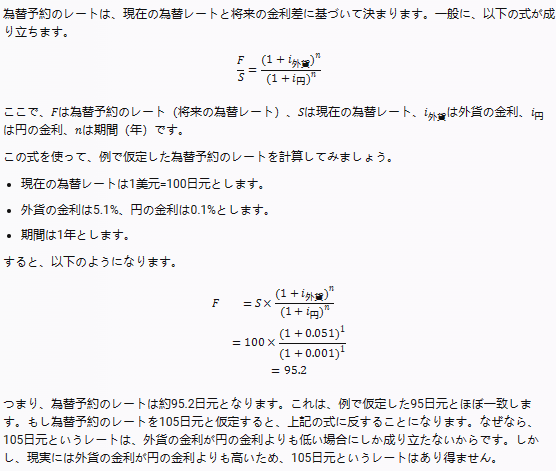

# Practical-Financial-Market-Lecture
This is a reading Memo for the Japanese book [Kenji Fujimaki's Practical Financial Market Lecture]. 
Here is it's Japanese name:【藤巻健史の実践・金融マーケット集中講義】 

＃第1章　為替のマーケット 
Hit-1：先物の値段というのは、皆さんの予想ではなく、金利差によって自動的に決まってくる。 

#Please check more content in the below link:
#藤卷健史 实践·金融市场集中讲义（藤巻健史の実践・金融マーケット集中講義） - Roy的文章 - 知乎
https://zhuanlan.zhihu.com/p/656678636
